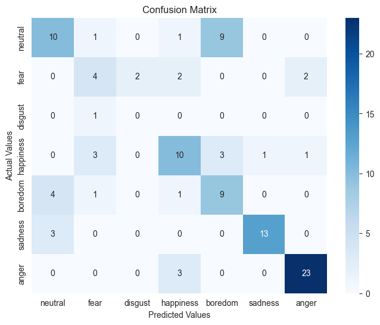

# Speech Emotion Recognition

Use case of an end-to-end solution for Speech Emotion Recognition (SER) in the German language. The goal is to accurately classify the emotional states conveyed in spoken German utterances. The project utilizes data from the [emo-db](http://emodb.bilderbar.info/start.html) database.

The best results achieved are:

|Emotion group|Precision |Recall|F1|
|:--:|:---:|:-:|:--:|
|neutral|0.48|0.43|0.46|
|fear|0.36|0.20|0.26|
|disgust|0.00|0.00|nan|
|happiness|0.64|0.35|0.45|
|boredom|0.27|0.48|0.34|
|sadness|0.77|0.74|0.76|
|anger|0.88|0.81|0.85|



## Data

The data comes from [emo-db](http://emodb.bilderbar.info/start.html) database.


## Model Selection

The final model chosen is a Neural Network with 3 layers, hidden layers are of size 50 and for each layer we perform Batch Normalization.
We selected this model by Cross Validation on different architecture and model types. Cross Validation was performed separating users to avoid overfitting, the function can be found [here](src/evaluation.py).

Below a summary of the CV results:


|Model|F1|Precision|Recall|
|:----:|:---:|:---:|:----:|
|LGC|0.44+-0.14|0.51+-0.13|0.48+-0.13|
||
|RFC_50|0.43+-0.15|0.47+-0.17|0.46+-0.15|
|RFC_100|0.43+-0.12|0.46+-0.10|0.46+-0.13|
|RFC_200|0.42+-0.14|0.47+-0.14|0.45+-0.14|
||
|XGB_50|0.39+-0.14|0.41+-0.16|0.42+-0.13| 
|XGB_100|0.39+-0.15|0.42+-0.17|0.42+-0.14|
|XGB_200|0.39+-0.13|0.41+-0.16|0.42+-0.13|
||
|stardardNet50|0.18+-0.05|0.19+-0.05|0.26+-0.07|
|standardNet100|0.15+-0.10|0.14+-0.11|0.25+-0.09|
|standardNet200|0.27+-0.10|0.30+-0.12|0.32+-0.08|
||
|netBn50|0.49+-0.06|0.54+-0.06|0.52+-0.07|
|netBn100|0.48+-0.06|0.50+-0.06|0.51+-0.07|
|netBn200|0.46+-0.07|0.52+-0.09|0.47+-0.08|
||
|netBnDr50|0.43+-0.07|0.48+-0.11|0.48+-0.09|
|netBnDr100|0.42+-0.06|0.48+-0.06|0.43+-0.07|
|netBnDr200|0.38+-0.08|0.40+-0.07|0.39+-0.08|


## Requirements


````
Flask==2.3.2
jupyter==1.0.0
matplotlib==3.7.1
numpy==1.24.3
pandas==2.0.2
requests==2.31.0
scikit-learn==1.2.2
scipy==1.10.1
seaborn==0.12.2
torch==2.0.1
torchaudio==2.0.2
torchvision==0.15.2
xgboost==1.7.5
````


## References

[Linguistic and Gender Variation in Speech Emotion Recognition using Spectral Features, Zachary Dair, Ryan Donovan, Ruairi O'Reilly (2021)](https://arxiv.org/pdf/2112.09596v2.pdf)

[Multimodal Speech Emotion Recognition
and Ambiguity Resolution](https://arxiv.org/pdf/1904.06022v1.pdf) -> great for extracting features

[Audio signal feature extraction and clustering
 ](https://medium.com/heuristics/audio-signal-feature-extraction-and-clustering-935319d2225)
