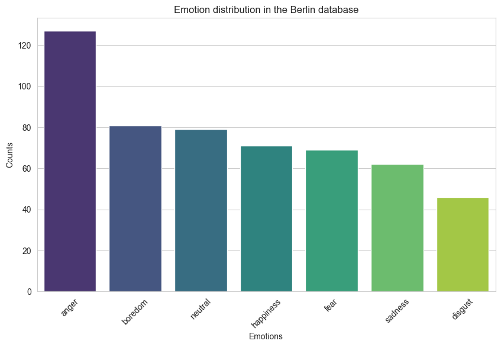

# Speech Emotion Recognition

Use case of an end-to-end solution for Speech Emotion Recognition (SER) in the German language. The goal is to accurately classify the emotional states conveyed in spoken German utterances. The project utilizes data from the [Berlin Database of Emotional Speech](http://emodb.bilderbar.info/start.html) database.

The best model trained has an accuracy of 64.49% on the test set. The results per category are:

|Emotion group|Precision |Recall|F1|
|:--:|:---:|:-:|:--:|
|neutral|0.48|0.43|0.46|
|fear|0.36|0.20|0.26|
|disgust|0.00|0.00|0.00|
|happiness|0.64|0.35|0.45|
|boredom|0.27|0.48|0.34|
|sadness|0.77|0.74|0.76|
|anger|0.88|0.81|0.85|

The investigation is performed in this [notebook](Report_SER.ipynb)

## Data

The data comes from [Berlin Database of Emotional Speech](http://emodb.bilderbar.info/start.html) database.

The Berlin Database of Emotional Speech It contains 535 utterances spoken by actors in a happy, angry, anxious, fearful, bored and disgusted way as well as in a neutral version. You can choose utterances from 10 different actors and ten different texts.



We separate the dataset into a train and test set. To avoid overfitting the data is separated by users (an actor can not have a recording in the train and another in the test set).

The train set has 428 recordings of 8 users and is used to:
- selecting the best features
- training the models
- select best hyperparameters

The test set contains the recordings of has 107 recordings of 2 users and is **only** used to evaluate the performance of the final models


## Model Selection

The final model chosen is a Neural Network with 3 layers, hidden layers are of size 50 and for each layer we perform Batch Normalization.
We selected this model by Cross Validation on different architecture and model types. Cross Validation was performed separating users to avoid overfitting, the function can be found [here](src/evaluation.py).

Below a summary of the CV results:


(UPDATE RESULTS -> MUCH BETTER RESULTS IN EXPERIMENTS reaching 0.65)

|Model|F1|Precision|Recall|
|:----:|:---:|:---:|:----:|
|LGR|0.49+-0.14|0.57+-0.14|0.52+-0.14|
||
|RFC_50|0.45+-0.14|0.53+-0.15|0.48+-0.14|
|RFC_100|0.47+-0.16|0.56+-0.16|0.50+-0.15|
|RFC_200|0.47+-0.16|0.56+-0.17|0.49+-0.15|
||
|XGB_50|0.46+-0.15|0.50+-0.17|0.49+-0.14|
|XGB_100|0.46+-0.14|0.50+-0.17|0.48+-0.13|
|XGB_200|0.46+-0.14|0.49+-0.17|0.48+-0.13|
||
|stardardNet50|0.26+-0.07|0.27+-0.11|0.35+-0.07|
|standardNet100|0.28+-0.07|0.29+-0.09|0.34+-0.05|
|standardNet200|0.26+-0.10|0.28+-0.10|0.34+-0.07|
||
|netBn50|0.58+-0.08|0.62+-0.08|0.58+-0.09|
|netBn100|0.54+-0.06|0.58+-0.08|0.57+-0.07|
|netBn200|0.56+-0.07|0.60+-0.07|0.57+-0.07|
||
|netBnDr50|0.49+-0.08|0.51+-0.09|0.52+-0.08|
|netBnDr100|0.49+-0.06|0.54+-0.08|0.50+-0.06|
|netBnDr200|0.50+-0.06|0.53+-0.07|0.52+-0.06|


## Requirements


````
Flask==2.3.2
jupyter==1.0.0
matplotlib==3.7.1
numpy==1.24.3
pandas==2.0.2
requests==2.31.0
scikit-learn==1.2.2
scipy==1.10.1
seaborn==0.12.2
torch==2.0.1
torchaudio==2.0.2
torchvision==0.15.2
xgboost==1.7.5
````

## Docker and Flask

### Installation in Docker

```
docker-compose build speech-emotion-recognition
docker-compose up speech-emotion-recognition
```

### Usage

One the docker is running you have 2 ports, one to access the [notebook](Report_SER.ipynb) and the other to access the FLASK API.

#### Notebook

To access the [notebook](Report_SER.ipynb), you have to go to the URL: http://0.0.0.0:5001 

Then you will arrive to a website where they ask you to introduct a password or token, you have to write:

```
visiumSER
```

#### FLASK API:

In the flask api there are 2 endpoints:

1. one for training the model
2. another for predicting an audio sample

Before predicting a sample, it is necessary to **train** first otherwise there will be no model in the docker and the prediction will not be possible

#### /train

To train the model once your docker is running:

1. Open a terminal
2. Write the following command:

```
curl --request GET --url 'http://0.0.0.0:5000/train'
```

Then the response should be like:

```
model trained with final acc in train: 0.7406542056074766 and in test: 0.616822429906542
```


#### /pred

Once you passed the train request, on the terminal write:

````
curl --request POST 'http://0.0.0.0:5000/pred' \
--header 'Content-Type: application/json' \
-d '{
    "id":"03a01Fa" }'
````

Then the response should be a dictionnary with the class:

```
{"class":"fear"}
```

## References

[Multimodal Speech Emotion Recognition and Ambiguity Resolution](https://arxiv.org/pdf/1904.06022v1.pdf) -> great for extracting features

[Audio signal feature extraction and clustering](https://medium.com/heuristics/audio-signal-feature-extraction-and-clustering-935319d2225)
